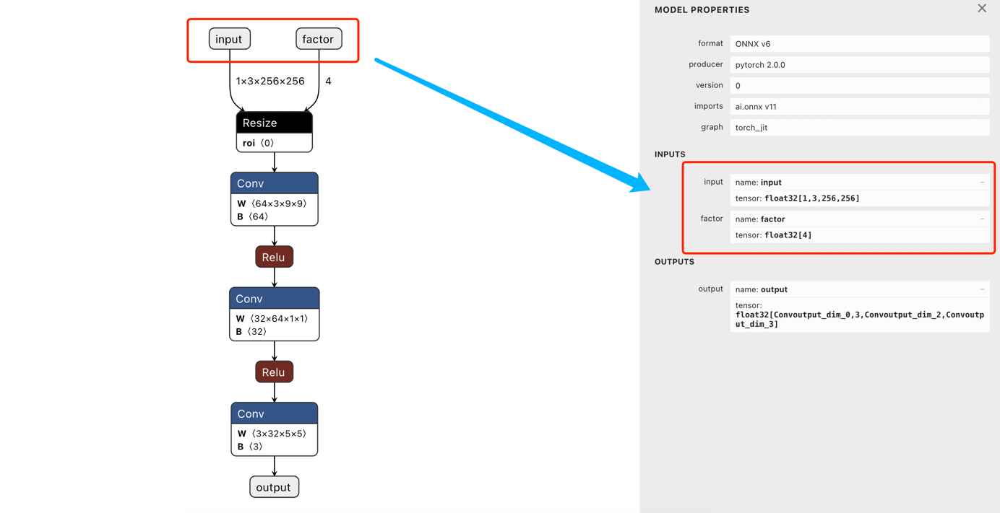

# 举例模型部署中涉及到算子重写的问题

[原教程](https://mmdeploy.readthedocs.io/zh-cn/latest/tutorial/02_challenges.html)

.py 使用顺序：
1. srcnn_model.py
2. diy_op_srcnn_model.py


后面还有一些解释自定义算子，具体的官方文档没有提到（也可能是我没找到）

抛出问题：
- `symbolic`函数 实现的参数有哪些？
- 怎么知道 `pyroch` 与 `onnx` 之间的哪些算子是需要等价实现的？比如这里 `onnx` 的 `Resize` 算子与 `pytorch` 中的 `interpolate` 算子等价 

---

之前的 [deploy_onnx_demo]() 中，缩放因子(upscale_factor) 是固定的，但是现在想要它变得动态。这个过程就可能涉及到算子重写的问题，
具体的细节东西看上面的教程。

原来的输入:


可以看到 `upscale_factor` 在这里是一个 [1,1,3,3] 的一维tensor, 是 `Constant`类型


<br>
<br>


下面是重定义算子后，计算图的输入变成了2个


<br>
<br>

## 重定义算子如下

```python
class NewInterpolate(torch.autograd.Function):

    @staticmethod
    def symbolic(g, input, scales):
        return g.op("Resize",
                    input,
                    g.op("Constant",
                         value_t=torch.tensor([], dtype=torch.float32)),
                    scales,
                    coordinate_transformation_mode_s="pytorch_half_pixel",
                    cubic_coeff_a_f=-0.75,
                    mode_s='cubic',
                    nearest_mode_s="floor")

    @staticmethod
    def forward(ctx, input, scales):
        scales = scales.tolist()[-2:]
        return interpolate(input,
                           scale_factor=scales,
                           mode='bicubic',
                           align_corners=False)
```

<br>
<br>

## NewInterpolate 类解释

`NewInterpolate` 类继承自 `torch.autograd.Function`，用于在 PyTorch 和 ONNX 模型中实现自定义的插值操作。这个类的主要作用是定义一个新的插值操作，该操作可以在模型导出到 ONNX 时被正确识别，并且在 PyTorch 中执行时保持相同的行为。

#### 类结构

`NewInterpolate` 类有两个静态方法：

1. `symbolic(g, input, scales)`
2. `forward(ctx, input, scales)`

### symbolic 方法

`symbolic` 方法定义了当 PyTorch 模型导出到 ONNX 格式时，如何将这个自定义操作映射到 ONNX 的等效操作。在这里，`symbolic` 方法定义了一个新的 `Resize` 操作。

```python
@staticmethod
def symbolic(g, input, scales):
    return g.op("Resize",
                input,
                g.op("Constant",
                     value_t=torch.tensor([], dtype=torch.float32)),
                scales,
                coordinate_transformation_mode_s="pytorch_half_pixel",
                cubic_coeff_a_f=-0.75,
                mode_s='cubic',
                nearest_mode_s="floor")
```

**参数解释：**

- `g`: 一个 `torch.onnx.Graph` 对象，用于构建 ONNX 计算图。
- `input`: 输入张量。
- `scales`: 缩放因子。

**返回值：**

- 返回一个新的 `Resize` 操作，它在 ONNX 模型中等价于 `interpolate` 操作。

**属性解释：**

- `coordinate_transformation_mode_s="pytorch_half_pixel"`: 指定坐标变换模式。
- `cubic_coeff_a_f=-0.75`: 指定三次插值系数。
- `mode_s='cubic'`: 指定插值模式为三次插值。
- `nearest_mode_s="floor"`: 指定最近邻插值模式。

`symbolic` 方法的作用是确保在导出为 ONNX 格式时，能够正确地将 PyTorch 中的自定义插值操作映射为 ONNX 中的 `Resize` 操作。

### forward 方法

`forward` 方法定义了在 PyTorch 中执行自定义插值操作时的具体实现。

```python
@staticmethod
def forward(ctx, input, scales):
    scales = scales.tolist()[-2:]
    return interpolate(input,
                       scale_factor=scales,
                       mode='bicubic',
                       align_corners=False)
```

**参数解释：**

- `ctx`: 上下文对象，用于在前向和反向传播之间传递信息。
- `input`: 输入张量。
- `scales`: 缩放因子。

**返回值：**

- 返回一个经过双三次插值（bicubic interpolation）处理后的张量。

`forward` 方法的作用是定义自定义插值操作在 PyTorch 中的前向计算。在这里，使用了 `torch.nn.functional.interpolate` 函数，采用双三次插值方式对输入张量进行缩放。

### 为什么这么实现？

- **兼容性**：确保自定义的插值操作在导出为 ONNX 时能够被正确识别和映射。
- **一致性**：保证在 PyTorch 和 ONNX 中使用相同的插值逻辑，确保模型在不同框架中表现一致。
- **可定制**：允许开发者自定义插值行为，以满足特定需求（例如，特定的插值模式和参数）。

### 总结

`NewInterpolate` 类通过定义 `symbolic` 和 `forward` 方法，实现在 PyTorch 和 ONNX 中一致的插值操作逻辑。`symbolic` 方法确保模型在导出为 ONNX 时能够正确映射自定义操作，而 `forward` 方法则定义了在 PyTorch 中的具体实现逻辑。这种实现方式增强了模型的兼容性和一致性，同时允许灵活定制插值操作。